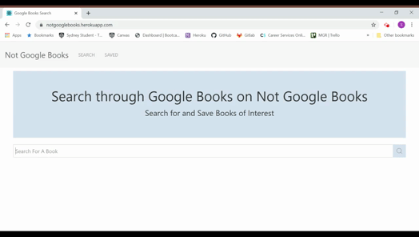
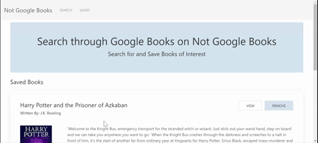

# google-books-search

## Description
Begin by searching for a book, and if Google Books has it, the page will display up to 40 books that could match the title searched for. Each book will display the: title (if no title, "Title Unknown"); subtitle (if applicable); authors (if no authors, "Unknown"); "View" button, that is a link to the Google Books page for the book; and a "Save" button, that will add the book to the list of saved books. If the user has just chosen to save a book from the search results, the "Save" button will change to "Remove", which the user can then choose to remove the book from the saved list. Additionally, if the search results contains a book that has been previously saved, it will automatically display "Remove" instead of "Save". All saved books can be seen by clicking on the "Saved" link in the navbar, where the user will be able to view the book's Google Books page or remove the book.

Search for a book, displays books if there's a match, display an error if not   

Click the "View" button to see the Google Books page for the book   

When a book is saved added to saved books, and "Save" button turns into "Remove". All currently saved books that show up in search results automatically display "Remove" instead of "Save"   

Remove a book from the list of saved books on the "Saved" page  

## User Story
AS A user  
I WANT to be able to search for a book available on Google Books and  
I WANT to be able to view the details of a book and  
I WANT to be able to have the ability to save the book or remove it  
SO THAT I can have a list of all the books I want to read in one place and can be accessed anywhere

## Installation
The app can be used through the deployed site above, but if you want to clone the repo, the application requires Node.js and MongoDB to be installed. 
1. Check if Node.js is installed by entering `node --version` into the command line. If it is installed, a version number should be displayed. 
   - If not, it can be [downloaded from their website](https://nodejs.org/en/download/), then check if it was installed properly by performing `node --version` 
2. If the command `mongod` or `mongo` is not recognised in the command line, MongoDB has not been installed. [Follow the guides here for your OS](https://docs.mongodb.com/manual/installation/)
3. Run `npm install` in the command line from the root directory of the project to install all dependencies
4. To run locally, run `npm start` in the command line from the root directory of the project and then it should automatically open the site in your default browser. 
    - If not, go to open your browser and enter localhost:3000
    
## Deployed Site
https://notgooglebooks.herokuapp.com/
